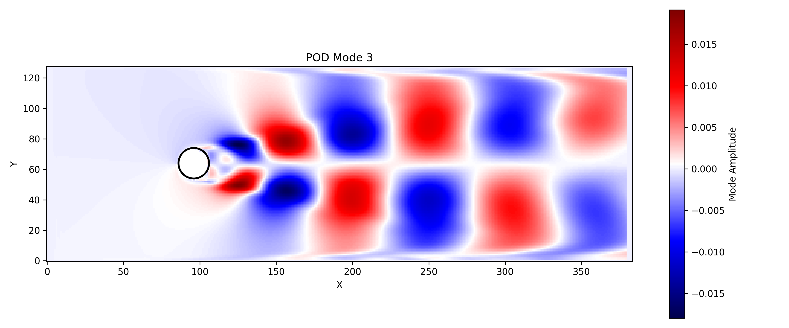
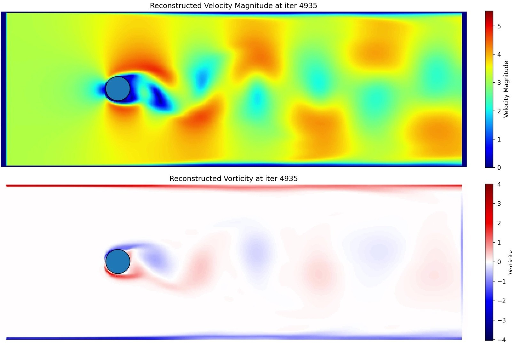

# Reduced-Order Modeling with Deep Learning: Flow Reconstruction for External Aerodynamics and Natural Convection

## Overview

This repository contains the materials associated with the project titled:

> **Reduced-Order Modeling with Deep Learning: Flow Reconstruction for External Aerodynamics and Natural Convection**

The project combines high-fidelity computational fluid dynamics (CFD), Proper Orthogonal Decomposition (POD), and deep neural networks (DNNs) to develop real-time surrogate models of turbulent thermal-fluid flows. The goal is to enable rapid and accurate prediction of complex fluid dynamics with significantly reduced computational costs.




---

## Project Structure

```
├── README.md                # Project documentation and instructions
├── Paper/                   # Final report and related documentation
│   └── Reduced_Order_Modeling_of_Turbulent_Fluid_Systems.pdf
├── Code/                    # Python source code and scripts
│   ├── CFD/                 # CFD simulation scripts
│   ├── POD/                 # Scripts for Proper Orthogonal Decomposition
│   ├── ML/                  # Machine learning surrogate models (MLP)
│   └── PostProcessing/      # FTLE, streamlines, and visualization scripts
├── Data/                    # Simulation data (large datasets stored externally)
│   └── (HDF5 or NPZ data files)
└── Animations_Figures/      # Visual results: plots, animations, and figures
```


---

## Key Results

- Achieved >99% flow energy reconstruction with fewer than 20 POD modes.
- ML surrogate yields under 2% mean squared reconstruction error.

---

## Contact

For questions, feedback, or collaboration, contact:

- **Tyler Jones**
- [tjjones6@wisc.edu]
- University of Wisconsin-Madison | B.S. Applied Mathematics, Engineering, and Physics (AMEP)

---

**Date:** May 2025  
**Version:** 1.0.0
